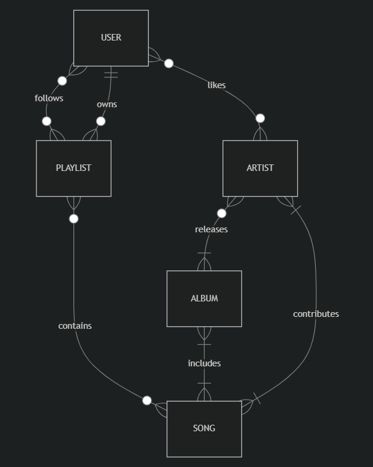

# Design Document

By Angel Alvarado Campos

Video overview: https://youtu.be/uCG9fOblKHQ 

## Scope

The database that I designed as my final project for CS50SQL describes all the entities involved in a **music-related data management system**. This model allows users to create and follow playlists, and like specific artists. It also let artists to participate in different songs and album releases. Included in the database's scope is:

- Users, including username and joined date.
- Artists, including name and description.
- Albums, including name and release date.
- Playlists, including name, description, and creator.
- Songs, including name, length and genre.

This database considers most of the basic relations that can be held in a modern music management system, such as songs belonging to many artists or to many albums (having a different track order in each of them); however, it does not provide a suitable framework for complex social features involving playlists. For example, this model enforces a playlist to be created by only one user. Out of the scope are also media files (as the song itself or artwork), song lyrics, and details about the production of each song or album (i.e. data related to the producer or studio involved).

## Functional Requirements

In this database every user should be able to create playlists and insert songs into it, follow other users playlists, as to keep track of the artists that it likes. Likewise, every artist should be able to register the songs in which it has contributed and the albums that it has released.

In summary, the database support:
- CRUD operations for users and artists
- Track the songs that are part of a playlists
- Track the songs that are part of a albums
- Track the artists that contributed in a song (being the main artist or a feature)
- Track the artists involved in a album release
- Track the artists that a user likes
- Basic data analysis framework for artists and songs

## Representation

The defined entities in SQLite follows the next schema.

### Entities

#### Users
The `users` table includes:
- `id`, which is the unique identifier of each user in the database, defined as a `INTEGER` with a `PRIMARY KEY` constraint applied on it.
- `username`, which specifies the unique username of each user in the database. It is a `TEXT` field and, since it uniquely identifies a user, it takes a `UNIQUE` constraint. It is defined as `NOT NULL` because all users must have a username.
- `join_date`, which is the date in which the user was register in the database. It is defined as `NUMERIC`, as usually dates are defined in SQLite; it is set with a default value of `CURRENT_TIMESTAMP`. It is defined as `NOT NULL` because all users must have a joined date.

#### Playlists
The `playlists` table includes:
- `id`, which is the unique identifier of each playlist in the database, defined as a `INTEGER` with a `PRIMARY KEY` constraint on it.
- `user_id`, which is the identifier of the user that created the playlist. It is defined as a `INTEGER` because that is the type of the `id` field in `users`, and `NOT NULL` because a playlist can not exists if it was not created by a user. Since a `user_id` is required to create a playlist, a `FOREIGN KEY` is applied on this field, referencing `id` on `users`.
- `name`, which is the name of the playlist. It is defined as a `TEXT` as a flexible name schema for the playlists and `NOT NULL` because there can not be a playlist without a name. I user can not own playlists that share the same name, hence the `UNIQUE` constraint on the `user_id` and `name` fields.
- `description`, which is a brief description of the content of the playlist. It is defined as a `TEXT` to provide a natural language description and `NOT NULL` because all playlists requires a description.
- `created_date`, which is the date in which the playlists was created. It is defined as a `NUMERIC` field, as is usual in date storage in SQLite, `NOT NULL` because all playlists requires a creation date to exist, and with a `DEFAULT` value of `CURRENT_TIMESTAMP`.

#### Songs
The `songs` table includes:
- `id`, which is the unique identifier of each song in the database, defined as a `INTEGER` with a `PRIMARY KEY` constraint.
- `name`, which is the name of the song, hence a `TEXT` field. It is defined as `NOT NULL` because all songs require a name to exist. There can be songs that share the same name.
- `length`, which is the length of a song in float format. Defined as `NUMERIC` to store a float and `NOT NULL` because all songs have a time duration.
- `genre`, which is the genre to which the song belongs. Define as a `TEXT` field and `NOT NULL` because all the songs have a genre.

#### Artists
The `artists` table includes:
- `id`, which is the unique identifier of each artist in the database, defined as a `INTEGER` with a `PRIMARY KEY` constraint.
- `name`, which is the name of the artist. There can not be two or more artists with the same name, therefore, the field is defined as a `NOT NULL`, `TEXT` field, with a `UNIQUE` constraint on it.
- `description`, which is a brief description of the artist. Defined as `TEXT NOT NULL` because all the artists require a description.

#### Albums
The `albums` table includes: 
- `id`, which is the unique identifier of each album in the database, defined as a `INTEGER` with a `PRIMARY KEY` constraint.
- `name`, which is the name of the album. The field is defined as `TEXT NOT NULL` because all the albums need a name to exist. There can be albums that share the same name.
- `release_date`, which is the date in which the album was released, defined as a `NUMERIC` field as the usual way to define dates in SQLite. It is `NOT NULL` because all the albums require a release date to exist.

#### Follows
The `follows` table is the *junction table* that relates the `users` and `playlists` tables, such that it represents when a user follows a playlist (being owned by the user involved or not). The table includes:
- `id`, which is the unique identifier of each row in the table, defined as a `INTEGER` with the `PRIMARY KEY` constraint.
- `user_id`, which is the unique identifier of the user that is being involved in the relation. It has a `FOREIGN KEY` constraint referencing the `id` field in `users`, hence it is defined as a `NOT NULL` and `INTEGER` field.
- `playlist_id`, which is the unique identifier of the playlist that is being involved in the relation. It has `FOREIGN KEY` constraint referencing the `id` field in `playlists`, hence it is defined as a `NOT NULL` and `INTEGER` field.

Both foreign keys, `user_id` and `playlist_id`, are defined as `NOT NULL` because a follow relation must include both entities. In this case, it does not make sense to have a partial relation.

It is also worth mentioning that there is a composite `UNIQUE` constraint on the `user_id` and `playlist_id` fields. This is to allow users to follow a specific playlists just once, because it would not make sense if the same user follows a playlist twice.

Another rule in this database is that every playlist owned by a specific user, will be automatically followed by that same user. To ensure this, a trigger named `follow_own_playlist` inserts a row in `follows`, with the corresponding data, whenever a new playlist is created in `playlists`.

#### Contains
The `contains` table is the *junction table* that relates the `playlists` and `songs` tables, such that it represents the songs that are part of a playlist. The table includes:
- `id`, which is the unique identifier of each row in the table, defined as a `INTEGER` with the `PRIMARY KEY` constraint.
- `playlist_id`, which is the unique identifier of the playlist that is being involved in the relation. It has a `FOREIGN KEY` constraint referencing the `id` field in the `playlists` table, hence it is defined as a `NOT NULL` and `INTEGER` field.
- `song_id`, which is the unique identifier of the song that is being involved in the relation. It has a `FOREIGN KEY` constraint referencing the `id` field in the `songs` table, hence it is defined as a `NOT NULL` and `INTEGER` field.
- `playlist_order`, which represents the position of the song inside the playlist. Since it defines a position in a list-like structure, it is a `INTEGER` field. It is `NOT NULL` because all the songs in a playlist must have a position.

Both foreign keys, `playlist_id` and `song_id`, are defined as `NOT NULL` because a contain relation must include both entities. In this case, it does not make sense to have a partial relation.

The table defines a composite `UNIQUE` constraint on the `playlist_id` and `song_id` fields, to ensure that a song doesn't repeat itself in the same playlist. Another composite `UNIQUE` constraint exists on the `playlist_id` and `playlist_order` to ensure that a there are not two or more songs with the same position in the playlist.

#### Likes
The `likes` table is the *junction table*  that relates the `users` and `artists` tables, such that it represents when a user likes a artist. The table includes:
- `id`, which is the unique identifier of each row in the table, defined as a `INTEGER` with the `PRIMARY KEY` constraint.
- `user_id`, which is the unique identifier of the user that is involved in the relation. It has a `FOREIGN KEY` constraint on the `id` field in the `users` table, therefore, it is defined as a `NOT NULL` and `INTEGER` field.
- `artist_id`, which is the unique identifier of the artist that is involved in the relation. It has a `FOREIGN KEY` constraint on the `id` field in the `artists` table, therefore, it is defined as a `NOT NULL` and `INTEGER` field.

Both foreign keys, `user_id` and `artist_id`, are defined as `NOT NULL` because a like relation must include both entities. It would not make sense to have a partial relation; for example, a user that follows nothing or a artist that is not followed by anyone.

A composite `UNIQUE` constraint exists on `user_id` and `artist_id` to ensure that a user likes a artist just once. This is specially useful for analytics, if we want to see how many followers have a artist by counting on this table.

#### Contributes
The `contributes` table is the *junction table*  that relates the `artists` and `songs` tables, such that it represents the songs to which an artist has contributed. The table includes:
- `id`, which is the unique identifier of each row in the table, defined as a `INTEGER` with a `PRIMARY KEY` constraint.
- `artist_id`, which is the unique identified of the artist that is involved in the relation. It has a `FOREIGN KEY` constraint on the `id` field in the `artists` table, therefore, it is defined as a `NOT NULL` and `INTEGER` field.
- `song_id`, which is the unique identified of the song that is involved in the relation. It has a `FOREIGN KEY` constraint on the `id` field in the `songs` table, therefore, it is defined as a `NOT NULL` and `INTEGER` field.

Both foreign keys, `artist_id` and `song_id`, are defined as `NOT NULL` because they must be included in a contribute relation.

A composite `UNIQUE` constraint exists on `song_id` and `artist_id` to ensure that a artist contributes to a song just once. This means that a specific artist can't participate two or more times in the same song.

#### Releases
The `releases` table is the *junction table* that relates the `artists` and `albums` tables, such that it represents albums released by single or multiple artists. The table includes:
- `id`, which is the unique identifier of each row in the table, defined as a `INTEGER` with a `PRIMARY KEY` constraint.
- `artist_id`, which is the unique identifier of the artist that is involved in the relation. It has a `FOREIGN KEY` constraint on the `id` field in the `artists` table, therefore, it is defined as a `NOT NULL` and `INTEGER` field.
- `album_id`, which is the unique identifier of the albums that is involved in the relation. It has a `FOREIGN KEY` constraint on the `id` field in the `albums` table, therefore, it is defined as a `NOT NULL` and `INTEGER` field.

Both foreign keys, `artist_id` and `album_id`, are defined as `NOT NULL` they must be included in a release relation. For example, it would not make any sense to have a `artist_id` with a `NULL` value in `album_id`; in the case of artists that does not release an album, it is better to not have any row in the `releases` table at all.

A composite `UNIQUE` constraint exists on `artist_id` and `album_id` to ensure that a artist releases a specific album just once. At the same time, it allows multiple artist to participate in the release of the same album (for example, albums like *Collision Course* by Linkin Park and Jay-Z).

#### Includes
The `includes` table is the *junction table* that relates the `albums` and `songs` tables, such that it represents the songs that are part of album. The table includes:
- `id`, which is the unique identifier of each row in the table, defined as a `INTEGER` with a `PRIMARY KEY` constraint.
- `album_id`, which is the unique identifier of the album that is involved in the relation. It has a `FOREIGN KEY` constraint on the `id` field in the `albums` table, therefore, it is defined as a `NOT NULL` and `INTEGER` field.
- `song_id`, which is the unique identifier of the song that is involved in the relation. It has a `FOREIGN KEY` constraint on the `id` field in the `songs` table, therefore, it is defined as a `NOT NULL` and `INTEGER` field.
- `track`, which is the track number of the song in the album. Since it represents a enumeration, it is a `INTEGER` field, and `NOT NULL` because all songs in a album must have a track number to be in order.

Both foreign keys, `album_id` and `song_id`, are defined as `NOT NULL` because they must be included in a include relation.

A composite `UNIQUE` constraint exists on `album_id` and `song_id` to ensure that a song does not appear two or more times in the same album. Another composite `UNIQUE` constraint exists on `album_id` and `track` to ensure that the songs in a album have a unique track numbering.

### Relationships

The diagram below represents the relation among the entities described in the database. Most of the the relations are many-to-many, which led to *junction tables* described in the section above.

- A user can like 0 or many artists, as well as artists can be liked by 0 or many artists. At the same time, a user can like the same artist just once (which is the same to say that a artist can be liked by a specific user just once).
- A user can own 0 or many playlists, and a playlists is owned by just 1 user.
- A user can follow 0 or many playlists, and a playlist can be followed by 0 or many users.
- A playlist can include 0 (empty) or many songs, and a song can be included in 0 or many playlists. A song that is part of a playlist has a unique ordering inside the playlist.
- A artist can contribute in 1 or many songs, and a song can be the result of the contribution of 1 or more artists.
- A artist can release 1 or many albums, and a albums can be released by 0 or many artists. A album released by 0 artists acts as a placeholder for albums that doesn't have a specific artists attached as its releaser (for example, some movie soundtracks may be listed as *Various Artists* in streaming services, hence it is not associated to a specific artist as its releaser).
- A albums can includes 1 or many songs, and a song can be included in 1 or many albums. A song that is part of a albums has a unique ordering inside the album. This relationship allows a song to be part of multiple albums, which makes sense, for example, when a song is part of a regular and album and a compilation album.

## Optimizations

Four views were created for aggregation purposes, such that it represents a small framework for data analysis on the database.
- `artists_stats`: Represents, for each artist that exists in the database, the number of albums released by artist and the number of songs to which the artist has contributed. The results of this view are ordered by the number of albums and the number of songs.
- `genre_stats`: Shows the number of songs that exists per genre in the database. 
- `songs_ranking`: Shows the songs in the database ordered by popularity. The popularity of each song is computed by how many playlists contain the song, based on the rows in the `contains` table.
- `artists_ranking`: Shows the artists in the database ordered by popularity. The popularity of each artist is measured by how many followers the artist has, based on the rows in the `follows` table.

To improve the performance of the possible commons queries in the database, 7 indices were created:
- `albums_name` on the `name` field in the `albums` table. Useful to search and find relations of a album by its name.
- `playlists_name` on the `name` field in the `playlists` table. Useful to search and find relations of a playlist by its name.
- `songs_genre` on the `genre` field in the `songs` table. Used to improve the performance of the query that defines the `genre_stats` view.
- `song_name` on the `name` field in the `songs` table. Even though users usually find songs by querying for a album or a playlist, the `name` field is heavily used as an aggregation parameter when songs have multiple contributors.
- `contains_song_id` on the `song_id` field in the `contains` table. Useful to join with the `songs` table while looking for the songs that are contained in a playlist.
- `likes_artist_id` on the `artist_id` field in the `likes` table. Useful to join with the `artists` table while looking for the artists that a user likes.
- `contributes_artist_id` on the `artist_id` field in the `contributes` table. Useful to join with the `artists` table while looking for the artists that contributed to a song. 

Besides the indices explicitely mentioned above, the database uses automatic indices which are a result of the `UNIQUE` constraints defined in some of the tables.

## Limitations

The current version does not allow collaborative playlists (playlists created by multiple users), nor playlists created by artists.
